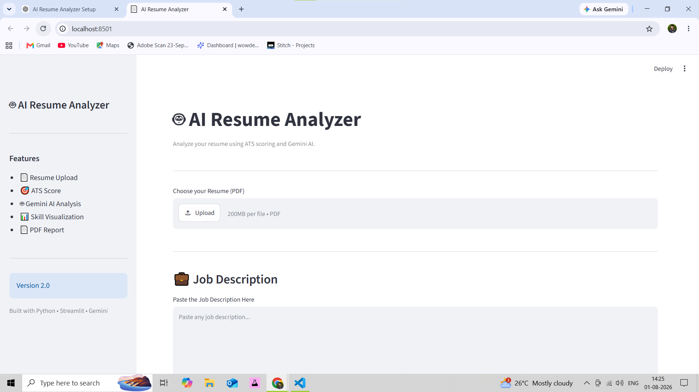

# 🤖 AI Resume Analyzer

An AI-powered Resume Analyzer built using **Python, Streamlit, Google Gemini AI, Sentence Transformers, and ReportLab**. It analyzes resumes against job descriptions using ATS scoring, semantic similarity, AI-powered feedback, and generates a downloadable PDF report.
---

## 🌐 Live Demo
https://ai-resume-analyze-epdc8ak5btq28qw69xh6a6.streamlit.app/
## 📂 GitHub Repository
https://github.com/Mustafa-TAT11/AI-Resume-Analyzer

## 📌 Features

- 📄 Upload Resume (PDF)
- 🎯 ATS Score Calculation
- 🧠 Semantic Similarity Analysis
- 🤖 AI Resume Feedback using Google Gemini
- 📊 Resume Quality Evaluation
- 📈 Skills Match Visualization
- 📄 Download PDF Analysis Report
- 🎨 Clean Streamlit Dashboard

---

## 🛠️ Tech Stack

- Python
- Streamlit
- Google Gemini API
- Sentence Transformers
- Scikit-learn
- PyMuPDF
- ReportLab
- Matplotlib

---

## 📂 Project Structure

```
AI-Resume-Analyzer/
│
├── app.py
├── README.md
├── requirements.txt
├── .env
│
├── backend/
│   ├── ats.py
│   ├── evaluator.py
│   ├── llm.py
│   ├── parser.py
│   ├── report.py
│   └── similarity.py
│
├── ui/
│   ├── sidebar.py
│   ├── uploader.py
│   ├── dashboard.py
│   ├── charts.py
│   └── feedback.py
│
├── assets/
└── uploads/
```

---

## ⚙️ Installation

Clone the repository

```bash
git clone https://github.com/YOUR_USERNAME/AI-Resume-Analyzer.git
```

Go to the project

```bash
cd AI-Resume-Analyzer
```

Create virtual environment

```bash
python -m venv venv
```

Activate virtual environment

Windows

```bash
venv\Scripts\activate
```

Install dependencies

```bash
pip install -r requirements.txt
```

Run the application

```bash
streamlit run app.py
```

---

## 📸 Screenshots

### Home Page



### ATS Dashboard

()

### AI Feedback

()

---

## 📈 Future Improvements

- AI Resume Rewriter
- AI Interview Question Generator
- Multi Resume Comparison
- Authentication
- Database Support

---

## 👨‍💻 Author

**Shaikh Mustafa Ali**

B.Tech Computer Science (AI & ML)

Interested in:
- Generative AI
- Machine Learning
- Python Development
- Software Engineering

---

## ⭐ If you like this project, give it a Star.
